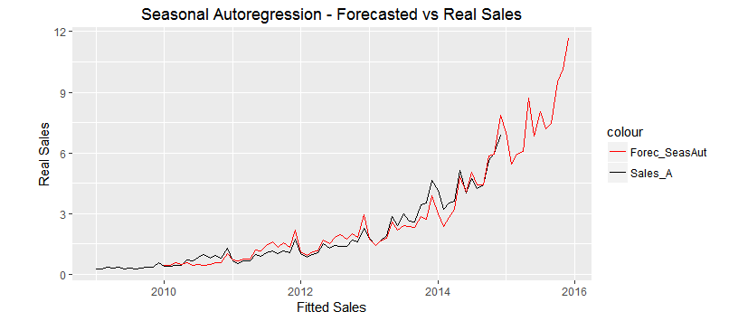
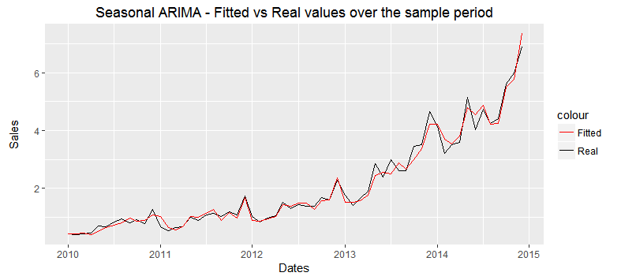

# Forecasting Case Study
Lefteris Nikolidakis  
20 March 2016  

<br>

#### Data Import


```r
require(XLConnect)
wb <- loadWorkbook("Forecasting Case Study.xlsx")

## Created an extra sheet3 in the Excel file already with the Data transposed
SalesData <- readWorksheet(wb, sheet = 3, header = TRUE)
names(SalesData) <- c("Dates", "Sales_A", "Sales_B","Sales_C", "Sales_D", "Sales_E")
```


_____________________________________________________________________________________

#### *<b><font face="Times New Roman" size="4">Question 1:</font></b>* 
##### *<font face="Times New Roman" size="3">Handset sales for Countries A to E are presented in the 'Data' tab, please describe the time series' in a paragraph focusing on the trend and the attributes of the data.*</font>
_____________________________________________________________________________________


In my time series analysis I chose to forecast the Sales for Country A. When looking at the time series plot below for the chosen variable, we notice a curved increasing trend over time and subsequent seasonal variations.  


```r
require(ggplot2)
ggplot(SalesData[1:72,], aes(x=Order, y=Sales_A)) + geom_point(alpha=0.5) + geom_line(alpha=0.4) + geom_smooth(se = FALSE) + ylab("Country A Sales") +ggtitle("Sales for Country A over time") + scale_x_continuous(breaks=breaks, labels=labels)
```


As well as looking at the time plot of the data, the ACF plot also indicates non-stationary time series since the coefficients decrease very slowly.


```r
## Transform data set to time series object
require(stats)
require(forecast)
TSData <- ts(data=SalesData$Sales_A[1:72], frequency = 12, start = c(2009, 1))
```


```r
require(ggfortify)
autoplot(Acf(TSData, plot=FALSE)) + ggtitle("Autocorrelation coefficients of Sales")
```


_____________________________________________________________________________________

#### *<b><font face="Times New Roman" size="4">Question 2:</font></b>* 
##### *<font face="Times New Roman" size="3">Please generate point forecasts for one or more of the countries, for the period Jan 15 - Dec 15, using relevant available information.*</font>
_____________________________________________________________________________________


The time series graph below shows the point forecasts for 2015. The forecasts were derived after employing a **Seasonal Autoregressive Integrated model** on our Sales time series for Country A, which is a forecasting techique that simultaneously estimates non-stationary trends and seasonal patterns.


```r
require(ggfortify)
autoplot(ForecastARI) + ylab("Sales for Country A") + ggtitle("ARIMA - Forecasts for Jan 15 - Dec 15")
```


_____________________________________________________________________________________

#### *<b><font face="Times New Roman" size="4">Question 3:</font></b>* 
##### *<font face="Times New Roman" size="3">Explain your methodology, and your reasons for choosing the methodology.*</font>
_____________________________________________________________________________________

When we looked at the time series plot before, we clearly noticed 2 types of variation:

1. Subsequent seasonal variations 

2. Non-stationary increasing trends

<br>

To confirm my 2 inspections I applied separately in the time series sales,

- **A Seasonal autoregressive model** that sets each fitted value to be linearly related to the last observed value from the same season of the year.<br>
The AR(1) process is <b><i>y<sub>t</sub> = a + by<sub>t-12</sub> + e<sub>t</sub></i></b> where y<sub>t-12</sub> the observed value in the previous season.

- **Differencing**, that transforms nonstationary series to stationary. This is done by subtracting the observation in the current period from the previous one and this process essentially eliminates the trend if the series is growing at a fairly constant rate.<br>
THe I(1) process is <b><i>Y<sub>t</sub> - Y<sub>t-1</sub> = DY<sub>t</sub></i></b>

<br>

#### Seasonality

The seasonal plot below demonstrates how sales behave each month against the individual Years (seasons). It is clear that each month's value is highly correlated with all previous years' values in the respective month.


```r
SalesData$Month <- as.factor(format(SalesData$Dates, "%m"))

ggplot(SalesData[1:72,], aes(Month, Sales_A)) + geom_line(aes(group=Year,  colour=Year)) + geom_point(aes(group=Year, colour=Year)) + xlab("Months") + ylab("Sales Volume") + ggtitle("Seasonal Plot - Sales each Year")
```


When comparing the forecasted values from the seasonal AR(1) model with the real sale values it is confirmed that the seasonal pattern explains the variability quite well.


```r
SalesData$SeasAut <- NA
SalesData$SeasAut[13:length(SalesData[,1])] <- SalesData$Sales_A[1:72]

FIt <- lm(Sales_A ~ 0 + SeasAut, data=SalesData)
```


```r
SalesData$Forec_SeasAut <- FIt$coef[1]*SalesData$SeasAut

ggplot(SalesData, aes(x=Dates)) + geom_line(aes(y=Sales_A, colour="Sales_A")) + geom_line(aes(y=Forec_SeasAut, colour="Forec_SeasAut")) + xlab("Fitted Sales") + ylab("\n\nReal Sales") + ggtitle("Seasonal Autoregression - Forecasted vs Real Sales") + scale_color_manual(values=c("red", "black"))
```



<br>

#### Trend

The time series plot below demonstrates the *integrated of order one* residuals which are the sales points after removing the non-stationary increasing trend. 


```r
autoplot(diff(TSData,1)) + ggtitle("De-trended Sales over time") + ylab("Residuals")
```


We notice that even if differencing stabilizes the mean of the time series, the variance of the residuals is still increasing over time. 

To address the observed heteroscedasticity I could have applied log-transformation on the series. Nevertheless, as shown afterwards, the instability of the variance can be controlled by the seasonal AR process.


```r
autoplot(diff(log(TSData),1)) + ggtitle("De-trended Log-transformed Sales over time") + ylab("Residuals")
```


Now that we removed the trend pattern, we can re-check the lagged autocorrelation coefficients. 
The autocorrelation plot of the differenced Sales below, shows that 1st order differencing didn't address the seasonality. Also the highest coefficient is of lag 12, which justifies the seasonal auttoregressive pattern we identified previously.


```r
autoplot(Acf(diff(TSData,1), plot=FALSE)) + ggtitle("Autocorrelation coefficients of De-Trended Sales")
```


<br>

#### Seasonal AR Integrated method

The model that I applied for forecasting the 2005 sales was the Seasonal ARIMA(0,1,0)(1,1,0) which denotes an AR model with 1 seasonal autoregressive lag and a difference in the order of 1. <br>
The summary of my chosen model is shown below:


```r
summary(Arima)
```

```
## 
## Call:
## arima(x = TSData, order = c(0, 1, 0), seasonal = list(order = c(2, 1, 0), frequency = c(12, 
##     1, 0)))
## 
## Coefficients:
##         sar1    sar2
##       0.4965  0.0620
## s.e.  0.1566  0.1857
## 
## sigma^2 estimated as 0.04172:  log likelihood = 7.98,  aic = -9.95
## 
## Training set error measures:
##                      ME      RMSE       MAE       MPE     MAPE      MASE
## Training set 0.01303818 0.1849059 0.1230339 0.3007038 7.138826 0.3950885
##                    ACF1
## Training set -0.1954534
```

Below are some basic diagnostic plots for our model that assess the validity of the model and the outcomes are the following:

1. The residuals' autocorrelation points are white noise and below the critical value.

2. The residuals are approximately normally distributed

3. No outliers are present

4. The variance of the residuals is higher in the latest part of the series (2013-2015) but in insignificant level. 


```r
Fitted <- ForecastARI$fitted
Real <- SalesData$Sales_A[1:72]
Errors <- ForecastARI$residuals
Dates <- SalesData$Dates[1:72]
temp <- data.frame(Dates, Real, Fitted, Errors)

ggplot(temp[13:72,], aes(Dates)) + geom_line(aes(y=Real, colour="Real")) + geom_line(aes(y=Fitted, colour="Fitted")) + ggtitle("Seasonal ARIMA - Fitted vs Real values over the sample period") + ylab("Sales\n") + scale_color_manual(values=c("red", "black"))
```




<br>
